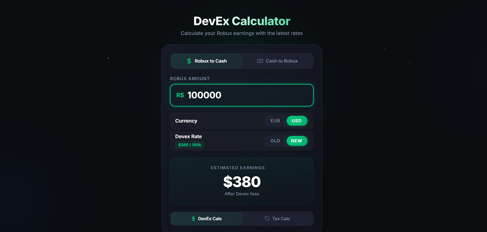

# Robux DevEx & Tax Calculator

A sleek, modern web tool for Roblox developers and traders to calculate Developer Exchange (DevEx) earnings and marketplace taxes instantly.

## 🚀 Live Demo
[**Use the Calculator**](https://jojocrafthp.github.io/RobuxCalc/)

## ✨ Features
- **DevEx Calculator**: Convert Robux to USD/EUR with the latest exchange rates ($380/100k or legacy rates).
- **Tax Calculator**: Calculate the 30% Roblox marketplace fee for selling items.
- **Reverse Calculations**: Calculate how much Robux you need to cash out a specific amount of USD/EUR.
- **Privacy First**: All calculations happen in your browser. No data is stored.
- **Analytics**: Lightweight, privacy-friendly tracking via Cloudflare Web Analytics.

## 🛠️ Built With
- HTML5
- CSS3 (Variables, Flexbox, Animations)
- Vanilla JavaScript (ES6+)

## 🤝 Contributing
Contributions are welcome! Feel free to fork the repository and submit a pull request.

1. Fork the Project
2. Create your Feature Branch
3. Commit your Changes
4. Push to the Branch
5. Open a Pull Request

## 📄 License
Distributed under the MIT License. See `LICENSE` for more information.

## 👤 Author
**JoJocraftHP**
- GitHub: [@JoJocraftHP](https://github.com/JoJocraftHP)
